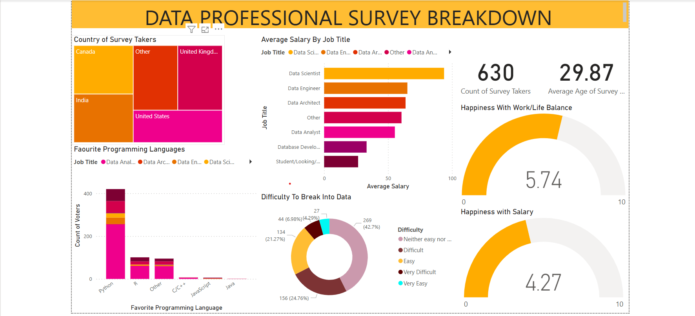

# Data Professional Survey Dataset
This dataset contains responses from data professionals about their current roles, salaries, job satisfaction, career challenges and preferences. The survey aims to provide insights into the landscape of the data industry, highlighting various aspects of the profession from the perspective of those within it.

## Dataset Overview
The dataset includes the following columns:

1. Current Role: The current job title or position of the respondent.
2. Current Yearly Salary: The annual salary of the respondent in their current role.
3. Job Satisfaction: Whether the respondent is happy with their current position (Yes/No).
4. Difficulty Breaking Into Data: How difficult it was for the respondent to enter the data industry (scale or categorical).
5. Gender: The gender of the respondent (Male/Female).
6. Age: The current age of the respondent.
7. Favorite Programming Language: The programming language the respondent prefers the most.
8. Country: The country where the respondent is currently based.

## Usage
This dataset can be used for various purposes, such as:

1. Analyzing salary trends across different roles and countries.
2. Studying the relationship between job satisfaction and other factors like salary, role, and difficulty of breaking into the field.
3. Exploring demographic distributions within the data profession.
4. Understanding preferences for programming languages among data professionals.

## How to Access the Data
The dataset is available in a .xlsx format for easy use and integration into your data analysis workflows. You can download the dataset from the repository and load it into Power BI to start your analysis.

